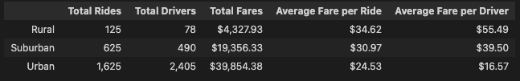
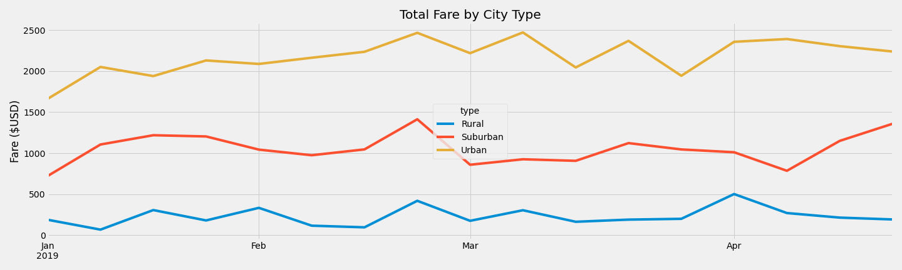

# Pyber Challenge

## Overview of the analysis

The purpose of this analyis is to summarize data for a ridesharing app to understand the disparities between the 3 different types of cities (urban, suburban, and rural). More specifically, using Python and Pandas, we need to create a dataframe summarizing the ride data by city type. Then using Matplotlib, we need to create a multi-line graph showing the total weekly fares for each city type. Finally, using the dataframe and the graph created, we should draw conclusions on how to address any disparities among the city types.

## Results

### The Summary DataFrame

Below dataframe shows us a summary of the data found in the city_data.csv and ride_data.csv files, which can be found in the Resources folder.

In the dataframe we can see the following differences between the 3 different city types:

- Rural city has the lowest number of rides and drivers, but highest averages.
  - The rural city type has the least amount of total rides (125), total riders (78), and total fares ($4,327.93). On the other hand, it has the highest average fare per ride ($34.62) and the highest average fare per driver ($55.49)
  - The ratio total rides / total drivers is 1.6
- Urban city has the greatest number of rides and drivers, but lowest averages.
  - The urban city type has the highest amount of total rides (1,625) total drivers (2,405) and total fares ($39,854). However, it has the lowest average fare per ride ($24.53) and the lowest average fare per rider ($16.57)
  - The ratio total rides / total drivers is 0.67
- The suburban city type numbers are in between the urban and rural city types.
  - The suburban city type has 625 total rides, 490 total drivers and $19,256.33 in total fares. Its average fare per ride is also in between those of the urban and rural cities, at 30.97. Its average fare per rider is $39.5
  - The ratio total rides / total drivers is 1.27 (closer to rural than to urban)
  - While the suburban city is in between the urban and rural cities, it is more similar to the rural city.

### The Summary Graph

Below graph summarizes the total fares by city type from Jan 2019 to April 2019.

- In the graph we can see that the fare behavior for all cities follows the same overall pattern, where each week is a peak or dip in the line graph.

## Summary

In order to address the disparities between the cities, the ride sharing app should allocate more resources to increase the amount of drivers in both the suburban and rural types of cities. The app could also allocate more marketing in the suburban and rural city types to increase the amount of rides, once they have enough drivers to keep up with the demand. If keeping a balance between supply (drivers) and demand (riders) is an issue, the app could consider surge pricing, where fares would be multiplied when rider demand ishigher than driver supply. This would create a balance between demand and supply.
